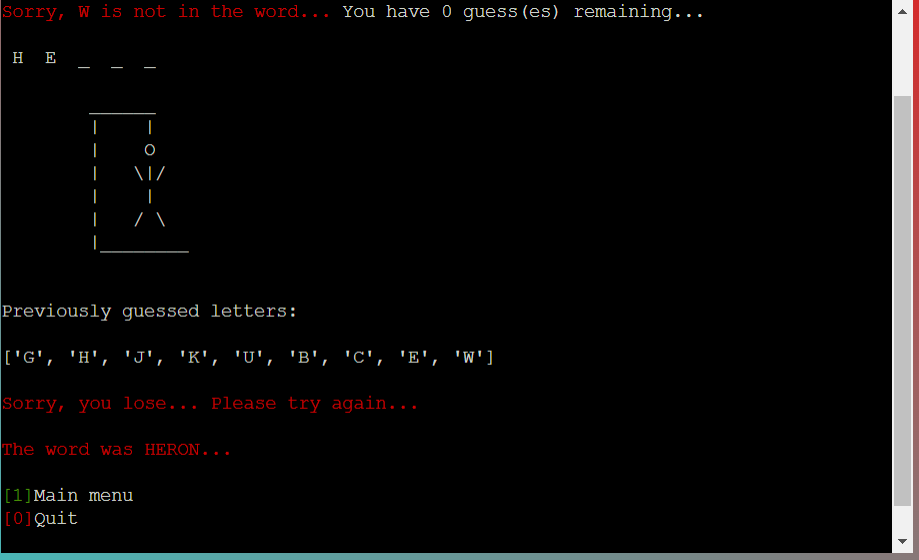

# **Hangman**

 

**Live deployed application can be found** [HERE](https://hangman-james-fitz.herokuapp.com/)  

 

## **Introduction**

[Hangman](https://en.wikipedia.org/wiki/Hangman_(game)) is a simple word game that requires the player to guess the missing letters in an unknown word where the length of the word is known.
The strategy most commonly implemented while playing the game of hangman is to guess the most commonly seen letters in the English language first and try to work out the answer from there.
Often players will begin by guessing the vowels, A,E,I,O and U, which gives a good starting point to discovering the word.

This project is a terminal based hangman game that is written completely using the Python programming language.
User input is accepted through number or letter entries into the command line of the terminal.

I decided to allow the user to choose a category of words to pick from (animals, brands or countries), and also a difficulty level to choose from (easy: 5 letter word, intermediate: 6 letter word, or hard: 7 letter word).
This allows more variety and gives the user a hint at what word they will be guessing which in turn creates a more enjoyable experience.

The random words are stored on an external google spreadsheet which makes it very simple to add or remove words from the game at any time.

Once the user begins a new game, they must input one letter at a time to guess the hidden word.
If the user guesses a letter correctly, the letter will be revealed.
If the user guesses incorrectly, a body part will be added to the hangman image and the player must guess again.
All previously guessed letters are displayed to the user.
The game ends when either the player guesses all the letters correctly or the hangman is fully formed and the player loses.

When the game is over, the results will be displayed and the sub menu will be displayed for the user to return to the main menu or quit the game.

 

## **Table of Contents**
- [**Hangman**](#hangman)
  - [**Introduction**](#introduction)
  - [**Table of Contents**](#table-of-contents)
  - [**UX and Design**](#ux-and-design)
  - [**Features**](#features)
  - [**Testing**](#testing)
  - [**Technology Used**](#technology-used)
  - [**Deployment**](#deployment)
  - [**Credits**](#credits)

## **UX and Design**  

I wanted to ensure a very clean, easy to understand and visually appealing UX for this project.
As it is a terminal based project there wasn't a lot of scope for design choice.
I implemented a simple color gradient for the background of the page to make the terminal stand out to the user.
I also centred the terminal on the window as I feel it is more appealing for the player.

The application opens to a main menu with some ASCII art displaying the Hangman title.
The selections available to the user are colored. "Play game", "Rules" and "Credits" are colored green and "Quit" is colored red.
This ensures that the user knows the 0 input will end the application.

Once the user enters 1 to play the game, they are given 3 options for category choice.
"Animals", "Brands" or "Countries".
These numbers are also colored to be more visually appealing to the user.

Once the user chooses a category they are given a choice of diificulty levels.
"Easy", "Intermediate" or "Hard".
These numbers are color coded green, yellow and red respectively as these are universally understood colors to indicate difficulty level.

Once the user has chosen the difficulty level the game screen will be displayed.
The category and difficulty choice will remain at the top of the page.
Below these, there are a number underscores denoting the amount of letters in the word.
Below the underscores, there will be an ASCII art image of a gallows, showing the player how close they are to losing.
Below the gallows the players previously guessed letters are displayed and underneath this is a player input request.

I have used red and green throughout this project to inform the user when an invalid/incorrect entry has been made and when a valid/correct entry has been made.

If a user inputs an invalid entry, an incorrect answer or loses the game, they will be given a message in red.

If the user guesses a letter correctly or wins the game, they will be given a message in green.

Target Audience

- This game is suitable for all age groups.
- This game was made for fans of simple word games.
- This game is for anyone that enjoys simple terminal based games.

User Experience and Expectations
  

- Simple game to play.
- Clear instructions and rules that are easy to understand.
- Simple design and easy navigation.
- intuative design where results and outcomes are easily identified and displayed.
- Clear indication of input errors to the user.
- Ability to see progress throughout the game, how many guesses are left, how many letters guessed correctly, which letters have already been guessed.
- Variety and choice for a new experience every time.
- Ability to return to the main menu at the end of the game and restart the application.

Flow Chart
  

I created the flowchart before starting to write the code to give myself a good understanding and idea of what I wanted to achieve.
It was useful knowing where the input errors could occur and what to do if that happened.
There are some optional additions on the flowchart that I ultimately did decide to implement into the project.

Wireframe
  

I had a simple wireframe design for this project with a main menu, rules section, credits section and main game screen.
The end design is very similar to the wireframe with only a few small differences.

- Main Menu

- Rules Screen

- Credits Screen

- Category Choice

- Difficulty Choice 

- Game Screen 

- Correct Guess

- Error Guess

- Win Screen 

Color Palette

As this is a terminal based project, there wasn't much scope for color modifications.
I added color to the terminal using colorama, and I added a simple red to cyan gradient background to the body of the page using css.

 

## **Features** 

Main Menu
     

I decided to implement a main menu in this project to allow the user to navigate to different sections of the application with ease.
The hangman ASCII art was used to make the menu screen more appealing to the player.
The main menu contains 4 options, "Play Game" will run the main game function, "Rules" will display the rules for the game and a sub menu to return to the main menu, "Credits will display the credits for the game and a sub menu to return to the main menu, and "Quit" will exit the application and display a goodbye message.

Rules Page
     

The rules section is used to instruct the user on the rules of this hangman game. This section contains a sub menu to return to the main menu or quit the application.
I chose to keep this section simple with only the rules heading being colored as I wanted it to be easily read and understood by the player.

Credits Page
     

The credits section allows the user to see information about the creator of the game, links to the github repository, linkdin page and a thank you section.
The colorscheme and dusign was kept the dame as the rules section.

Sub Menu
  

The Sub menu is displayed at the end of the credits, rules and when the game is over.
This allows the user to easily navigate back to the main menu.

Category Choice

The category choice is displayed when the user starts a new game. This allows the user to customise their game an have a unique experience during every playthrough.

Difficulty Choice

The difficulty choice is diplayed once the category has been selected. This will allow the user to challege themselves to more difficult words on subsequent playthroughs.

Quit Screen

Once the player chooses the "Quit" option on either the main menu or sub menu, they are greeted with the following message and ASCII art.

Future Features
  

- Ability for player to input their own words or categories that will be pushed to the google sheet.  
- Ability for the player to guess the whole word at once rather than letter by letter.
- Implementation of timed game mode that will allocate a specified amount to time to make a guess depending on the difficulty level.

 

## **Testing**  

Python Linter Test Results
  

All python code was passed through the Code Institute Python Linter with no errors.

User Experience Testing

| User requirement | Image | Requirement met? Y/N | 
| ---------------- | ----- | -------------------- |
| I want to be shown a clear main menu when the application is loaded. |  | Y |
| I want to be shown an error message that clearly states why the error has occurred if I make an incorrect input. |   | Y | 
| I want to be able to view the rules for the game. |  | Y | 
| I want to be able to see who created the game. |  | Y | 
| I want to be able to choose my random word from different categories. |  | Y | 
| I want to be able to choose from different difficulty levels. |  | Y | 
| When the game starts, I want to be able to see my category, difficulty level, and how many letters I need to guess. |  | Y |
| If I make an invalid guess, or guess a letter that has already been guessed, I want a message to tell me why my guess was invalid, and I don't want this to affect my lives remaining. |  | Y | S
| When I make a correct guess, I want to be shown a message that my guess was correct, I want the correct letter to appear in the random word. |  | Y | 
| When I make an incorrect guess, I want a message to display that my guess was incorrect and I want to know how many lives I have left. |  | Y |
| When I win, I want to be shown a message that I won and I want the option to quit or play again. |  | Y | 
| When I lose, I want to be told what the word was and I want the option to quit or play again. |  | Y |

User Input Testing

| Test Area | Input To Validate | Expected Outcome | Actual Outcome | Pass/Fail |
| --------- | ----------------- | ---------------- | -------------- | --------- |
| Main Menu | N/A | Load main_menu function | As required | Pass |
| Main Menu | Input 0 | Quit the application | As required | Pass |
| Main Menu | Input 3 | Display credits | As required | Pass |
| Main Menu | Input 2 | Display rules | As required | Pass |
| Main Menu | Input 1 | Run the main game function | As required | Pass |
| Main Menu | Input any other number | Error message - Invalid choice - loop back to request input | As required | Pass |
| Main Menu | Input any other character | Error message - Not a number - loop back to request input | As required | Pass |
| Credits | Input 1 | Return to main menu | As required | Pass |
| Credits | Input 0 | Quit the application | As required | Pass |
| Credits | Input any other number | Error message - Invalid choice - loop back to request input | As required | Pass |
| Credits | Input any other character | Error message - Not a number - loop back to request input | As required | Pass |
| Rules | Input 1 | Return to main menu | As required | Pass |
| Rules | Input 0 | Quit the application | As required | Pass |
| Rules | Input any other number | Error message - Invalid choice - loop back to request input | As required | Pass |
| Rules | Input any other character | Error message - Not a number - loop back to request input | As required | Pass |
| Category Choice | Input 1 | Selects "Animals" category | As required | Pass |
| Category Choice | Input 2 | Selects "Brands" category | As required | Pass |
| Category Choice | Input 3 | Selects "Countries" category | As required | Pass |
| Category Choice | Input any other number | Error message - Invalid choice - loop back to request input | As required | Pass |
| Category Choice | Input any other character | Error message - Not a number - loop back to request input | As required | Pass |
| Difficulty Choice | Input 1 | Selects "Easy" difficulty | As required | Pass |
| Difficulty Choice | Input 2 | Selects "Intermediate" difficulty | As required | Pass |
| Difficulty Choice | Input 3 | Selects "Hard" difficulty | As required | Pass |
| Difficulty Choice | Input any other number | Error message - Invalid choice - loop back to request input | As required | Pass |
| Difficulty Choice | Input any other character | Error message - Not a number - loop back to request input | As required | Pass |
| Main Game Screen | Input a number | Error message - Invalid choice - loop back to request input | As required | Pass |
| Main Game Screen | Input multiple letters | Error message - One letter at a time - loop back to request input | As required | Pass |
| Main Game Screen | Correct letter guess | Display correct letter message, add letter to guessed letters list and display correctly guessed letter in the random word | As required | Pass |
| Main Game Screen | Guess all letters correctly | Display win message, display sub_menu to return to main menu or quit the application | As required | Pass |
| Main Game Screen | Incorrect letter guess | Display incorrect letter message, add letter to guessed letters list, remove one from guesses remaining and add body part to hangman | As required | Pass |
| Main Game Screen | Make 7 incorrect guesses | Display lose message, display sub_menu to return to main menu or quit the application | As required | Pass |

Browser Testing

The application was tested on multiple browers and a mobile android decvice. Results are seen below.

| Browser | Image | Result |
| ------- | ----- | ------ |
| Chrome |  | Working as expected |
| Firefox |  | Working as expected |
| Microsoft Edge |  | Working as expected |
| Microsoft Edge |  | Working as expected |

Bugs and Errors

There were many "line too long" errors in gitpod during development but these have all been dealt with by separating long lines of code onto multiple lines. t avoid the error.

 

## **Technology Used**  

Programs and Languages

- [Python programming language](https://en.wikipedia.org/wiki/Python_(programming_language)) - Used to write all of the code.
- [Github](https://github.com/) - Used to store the code progress and history.
- [Gitpod](https://www.gitpod.io/) - IDE used to write the python code, validate and push to github to document code progress.
- [Google sheets](https://www.google.com/sheets/about/) - Used to store the random words for our game.
- [Google cloud](https://cloud.google.com/) - Used to enable API's for the project.
- [Balsamiq](https://balsamiq.com/) - Used to create wireframes.
- [Lucidchart](https://www.lucidchart.com/pages/) - Used to create flowchart.
- [CI Python Linter](https://pep8ci.herokuapp.com/) - Used to check validity of Python code ensuring PEP 8standard is met.

Imports

- random - Allow a random word to be chosen.
- os - Allow clear function to clear terminal.
- gspread - Allow program to link with google sheets.
- colorama - Allow terminal print messages to be colored.

 

## **Deployment**  

This project was written using Gitpod IDE.
This project was deployed using Heroku cloud based deplaoyment service.

Code institute has supplied us with a [template](https://github.com/Code-Institute-Org/python-essentials-template) to display the terminal in the window. This template was used as the base for this project.

Heroku Deployment
  

1. Creat an account at [Heroku](https://www.heroku.com).
2. Select *New* in the top-right corner of your Heroku Dashboard, and select *Create new app* from the dropdown menu.
3. Your app name must be unique, and then choose a region closest to you (EU or USA), and finally, select *Create App*.
4. From the new app *Settings*, click *Reveal Config Vars*, and set the value of KEY to `PORT`, and the value to `8000` then select *add*.
5. Further down, to support dependencies, select *Add Buildpack*.
6. The order of the buildpacks is important, select `Python` first, then `Node.js` second. (if they are not in this order, you can drag them to rearrange them)

Heroku needs two additional files in order to deploy properly.
- requirements.txt
- Procfile

You can install this project's requirements (where applicable) using: `pip3 install -r requirements.txt`. If you have your own packages that have been installed, then the requirements file needs updated using: `pip3 freeze --local > requirements.txt`

The Procfile can be created with the following command: `echo web: node index.js > Procfile`

For Heroku deployment, follow these steps to connect your GitHub repository to the newly created app:

- In the Terminal/CLI, connect to Heroku using this command: `heroku login -i`
- Set the remote for Heroku: `heroku git:remote -a <app_name>` (replace app_name with your app, without the angle-brackets)
- After performing the standard Git `add`, `commit`, and `push` to GitHub, you can now type: `git push heroku main`

The frontend terminal should now be connected and deployed to Heroku.

How to Clone in GitHub
  

1. Navigate to the required repository on GitHub.  
2. Click the "Code" button, located below the nav bar and above the file list.  
3. Select either "HTTPS", "SSH" or "Github CLI" and click the copy button.  
4. Open Git Bash.  
5. Change the location of your cloned repository.  
6. Type <code>git clone</code> and then paste the URL you copied.  
7. Press “Enter” to create your clone.  

  

How to Fork in Github
  

1. Navigate to the required repository on GitHub.
2. Click "Fork" on the top right hand corner of the page.
3. Click "Create Fork" at the bottom of the page.

  

## **Credits**  

Media
  

- [Patorjk.com](https://patorjk.com/software/taag/#p=display&h=0&v=0&f=AMC%20Razor&t=Hangman) - Used to create ASCII art.
- [Lucidchart](https://www.lucidchart.com/pages/) - Used to create flowchart.
- [Balsamiq](https://balsamiq.com/) - Used to create wireframes.

  

Code
  

- [Colorama tutorial](https://www.youtube.com/watch?v=bg-quTTOeH4&ab_channel=TechNotebook) - Used to learn how to implement colorama into code.
- Code institute tutors.
- Fellow students in the CI Slack community and members of my study group.
- Stack overflow community advice on loops.
- Thanks to mentor Chris Quinn as always for the great ideas and advice.

  